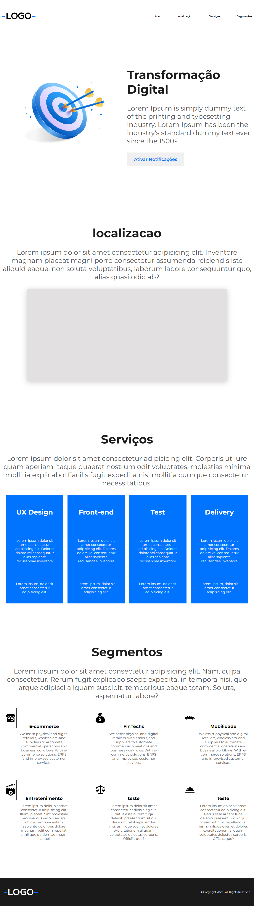

## tecnologias usadas no projeto HTML CSS Javascript e sass:
 - nesse projeto foi trabalhado o uso de API .
 - layout responsivo animacoes.
## Nesse projeto eu fui criando e estilizando por etapa:
 - primeiro eu criei e estilezei o header.
 - depois eu fui criando cada secao do projeto e estilizando. 
 - quando o HTML e CSS do projeto tava feito eu fui .adicionado o javascrip como o menu lateral e animacoes.
## Nesse projeto eu busquei no youtube para me ajudar a cria e adicionar algumas funcoes 
 - menu  lateral responsivo.
 - o uso de API.
 - animacoes com JS.
 - a parte do HTML e a responsividade eu nao precisei buscar ajuda eu criei sozinho com o meu conhecimento

 ### Site auvivo
 https://gleidsonfagno.github.io/special-topcs-EBAC/